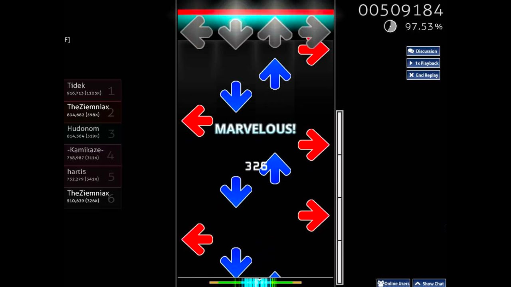
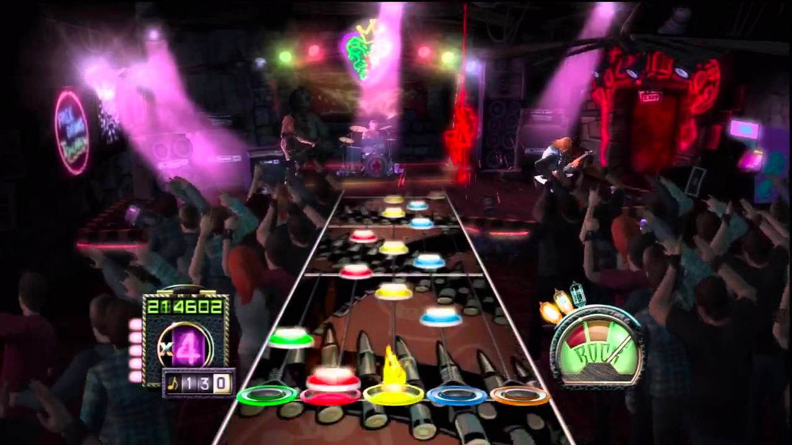

# Le nom du jeu

# Nom du jeu: OSU mania

### Style de jeu : Osu mania est un jeu de rythme similaire à guitare héros

### Langage du jeu : C# sur le framework .NET

## Règles du jeu: 

> Les règles de ce jeu sont simples, appuyer sur la touche correspondante à la bonne colonne quand la note arrive en bas de celle ci.
> 
> Dans le jeu initial les notes arrivent en rythme avec le morceau de musique.
> 
> On gagne plus ou moins de points en fonction de notre precision a appuyé au bon moment.
> 
> On perd de points de vie si on appuie trop en avance ou si on laisse la note passer.

## Mes règles modifier:

> Je vais en majorité reprendre les règles du jeu initial, mais je vais simplement faire apparaitre les notes aléatoirement et pas en rythme avec un morceau de musique. 

## To do list:
> Faire apparaitre les notes
> 
> Detecter la distance entre les notes et le bas de la colonne
> 
> Metre en place un système de vie 
> 
> 
> Metre en place un système de points en fonction de la distance entre la note et le bas de la colonne au moment du clique
> 
> Autre chose ...
